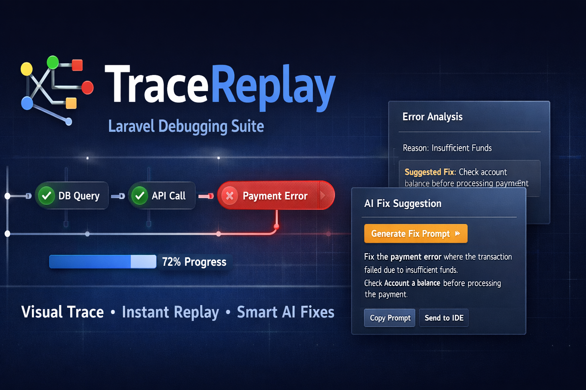
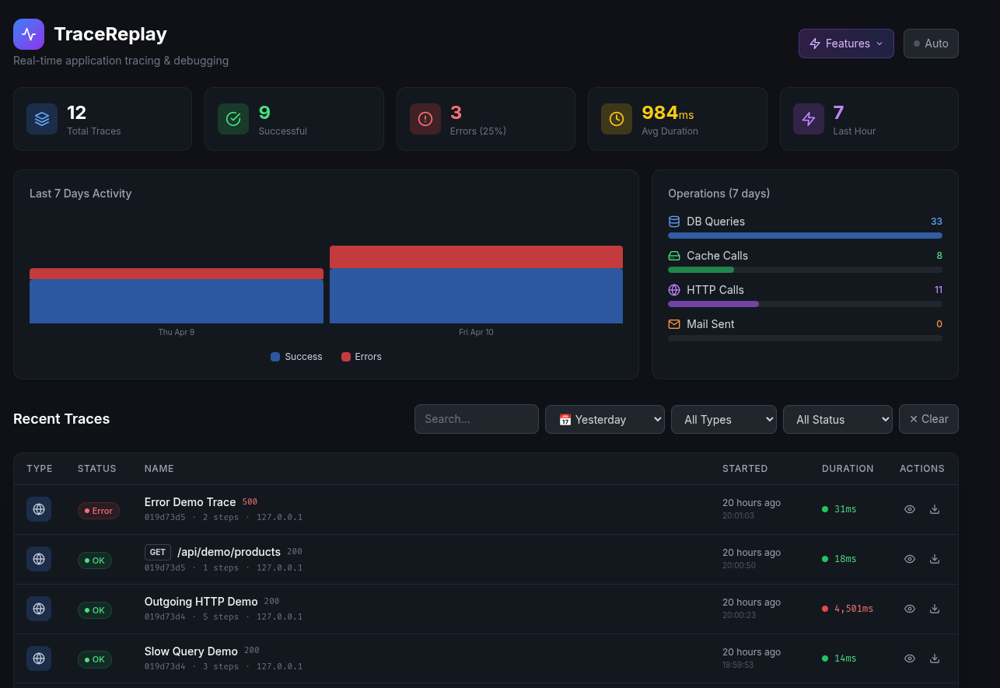
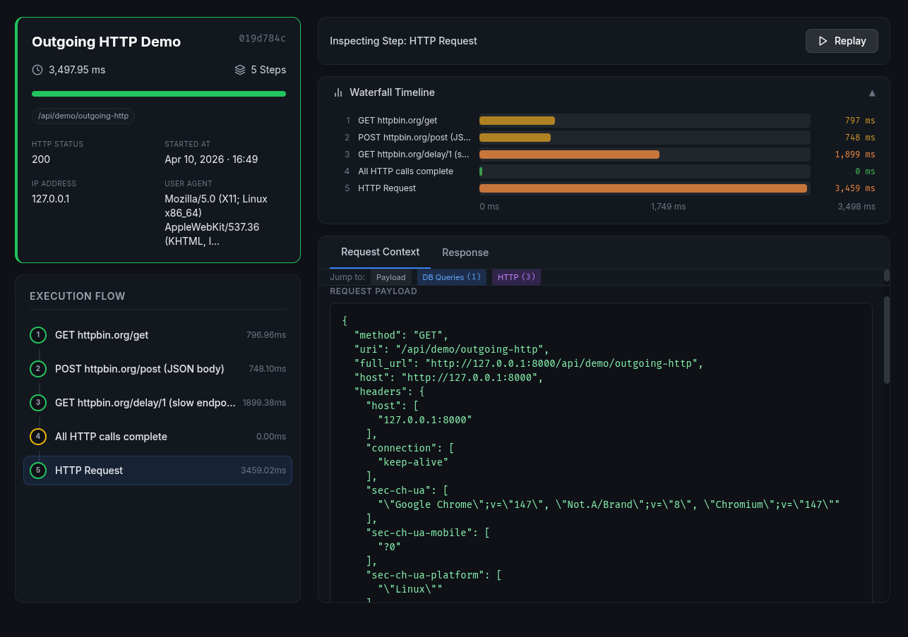

# TraceReplay

> **High-fidelity process tracking, deterministic replay, and AI-powered debugging for Laravel — production & enterprise ready.**

[](https://packagist.org/packages/iazaran/trace-replay)
[](https://php.net)
[](https://laravel.com)
[](LICENSE)
[](#testing)

TraceReplay is not a standard error logger. It is a full-fledged **execution tracer** that captures every step of your complex workflows, reconstructs them with a waterfall timeline, and offers one-click AI debugging when things go wrong.



---

## ✨ Key Features

| Feature | TraceReplay | Telescope | Debugbar | Clockwork |
|---|---|---|---|---|
| Manual step instrumentation | ✅ | ❌ | ❌ | ❌ |
| Waterfall timeline UI | ✅ | ❌ | ✅ | ✅ |
| Deterministic HTTP replay | ✅ | ❌ | ❌ | ❌ |
| Visual JSON diff on replay | ✅ | ❌ | ❌ | ❌ |
| AI fix-prompt generator | ✅ | ❌ | ❌ | ❌ |
| OpenAI / Anthropic / Ollama | ✅ | ❌ | ❌ | ❌ |
| Cache & HTTP tracking | ✅ | ✅ | ✅ | ✅ |
| Mail & Notification tracking | ✅ | ❌ | ❌ | ❌ |
| DB query tracking per step | ✅ | ✅ | ✅ | ✅ |
| Memory tracking per step | ✅ | ❌ | ✅ | ✅ |
| Peak memory tracking | ✅ | ✅ | ❌ | ❌ |
| Livewire Hydrate Tracing | ✅ | ❌ | ❌ | ❌ |
| PII / sensitive-field masking | ✅ | ❌ | ❌ | ❌ |
| Queue-job auto-tracing | ✅ | ✅ | ❌ | ❌ |
| Artisan-command auto-tracing | ✅ | ✅ | ❌ | ❌ |
| Probabilistic Sampling | ✅ | ❌ | ❌ | ❌ |
| Dashboard auth & Gate gate | ✅ | ✅ | ❌ | N/A |
| Multi-tenant scoping | ✅ | ❌ | ❌ | ❌ |
| W3C Traceparent support | ✅ | ❌ | ❌ | ❌ |
| Octane Compatible | ✅ | ✅ | ❌ | ❌ |

---

## 🛠 Installation

```bash
composer require iazaran/trace-replay
```

Publish the config and migrations:

```bash
php artisan vendor:publish --tag=trace-replay-config
php artisan vendor:publish --tag=trace-replay-migrations
```

Run migrations:

```bash
php artisan migrate
```

> **Note:** Migrations use `json` columns and support `decimal` precision for timings, compatible with MySQL 5.7+, MariaDB, PostgreSQL, and SQLite.

#### Publishing Views

To customize the dashboard UI:

```bash
php artisan vendor:publish --tag=trace-replay-views
```

This copies the Blade templates to `resources/views/vendor/trace-replay/` where you can customize the layout, colors, or add your own branding.

---

## ⚙️ Configuration

Open `config/trace-replay.php`. Key options include:

```php
return [
    'enabled' => env('TRACE_REPLAY_ENABLED', true),

    // 0.1 = trace 10% of requests/jobs/commands
    'sample_rate' => env('TRACE_REPLAY_SAMPLE_RATE', 1.0),

    // Automatically mask these keys in payloads
    'mask_fields' => ['password', 'token', 'api_key', 'authorization', 'secret'],

    // Dashbord security: only users passing the "view-trace-replay" gate can access
    'middleware' => ['web', 'auth'],

    // AI Troubleshooting (Drivers: openai, anthropic, ollama)
    'ai' => [
        'driver' => env('TRACE_REPLAY_AI_DRIVER', 'openai'),
        'api_key' => env('TRACE_REPLAY_AI_KEY'),
        'model' => env('TRACE_REPLAY_AI_MODEL', 'gpt-4o'),
    ],

    // Async batch persistence via queue (Reduces overhead)
    'queue' => [
        'enabled' => env('TRACE_REPLAY_QUEUE_ENABLED', false),
    ],

    // Auto-tracing
    'auto_trace' => [
        'jobs'     => true,
        'commands' => false,
        'livewire' => true,
    ],
];
```

---

## 🚀 Usage

### Manual Instrumentation

Wrap any complex logic in `TraceReplay::step()` — each callback's return value is passed through transparently.

```php
use TraceReplay\Facades\TraceReplay;

class BookingService
{
    public function handleBooking(array $payload): void
    {
        TraceReplay::start('Flight Booking', ['channel' => 'web']);

        try {
            $inventory = TraceReplay::step('Validate Inventory', function () use ($payload) {
                return Inventory::check($payload['flight_id']);
            });

            TraceReplay::checkpoint('Inventory validated', ['seats_left' => $inventory->seats]);

            TraceReplay::context(['user_tier' => auth()->user()->tier]);

            TraceReplay::step('Charge Credit Card', function () use ($payload) {
                return PaymentGateway::charge($payload['amount']);
            });

            TraceReplay::end('success');

        } catch (\Exception $e) {
            TraceReplay::end('error');
            throw $e;
        }
    }
}
```

**API Reference:**

| Method | Description |
|---|---|
| `TraceReplay::start(name, tags[])` | Start a new trace; returns `Trace` or `null` if disabled/sampled-out |
| `TraceReplay::step(label, callable, extra[])` | Wrap callable, record timing, memory, DB queries, errors |
| `TraceReplay::measure(label, callable)` | Alias for `step()` — semantic clarity for benchmarks |
| `TraceReplay::checkpoint(label, state[])` | Record a zero-overhead breadcrumb (no callable) |
| `TraceReplay::context(array)` | Merge data into the next step's `state_snapshot` |
| `TraceReplay::end(status)` | Finalise trace; status: `success` or `error` |
| `TraceReplay::getCurrentTrace()` | Returns the active `Trace` model (or `null`) |
| `TraceReplay::setWorkspaceId(id)` | Scope subsequent traces to a workspace |
| `TraceReplay::setProjectId(id)` | Scope subsequent traces to a project |

---

### Testing Helper

Use `TraceReplay::fake()` to verify your instrumentation in tests without hitting the database:

```php
use TraceReplay\Facades\TraceReplay;

public function test_booking_records_steps()
{
    $fake = TraceReplay::fake();

    $this->post('/book', ['flight_id' => 123]);

    $fake->assertTraceStarted('Flight Booking');
    $fake->assertStepRecorded('Validate Inventory');
    $fake->assertStepRecorded('Charge Credit Card');
    $fake->assertCheckpointRecorded('Inventory validated');
    $fake->assertTraceEnded('success');
    $fake->assertTraceCount(1);
}
```

**Available assertions:**

| Assertion | Description |
|---|---|
| `assertTraceStarted(name)` | Assert a trace with the given name was started |
| `assertNoTraceStarted()` | Assert no trace was started at all |
| `assertTraceCount(n)` | Assert exactly `n` traces were started |
| `assertStepRecorded(label)` | Assert a step with the given label was recorded |
| `assertCheckpointRecorded(label)` | Assert a checkpoint with the given label was recorded |
| `assertStepCount(n, traceName?)` | Assert exactly `n` steps in total (or in a named trace) |
| `assertTraceEnded(status)` | Assert a trace with the given final status exists |

---

### Auto HTTP Ingestion (Middleware)

Automatically trace every HTTP request. Add to `app/Http/Kernel.php`:

```php
protected $middlewareGroups = [
    'web' => [
        // ...
        \TraceReplay\Http\Middleware\TraceMiddleware::class,
    ],
];
```

For Laravel 11+ (using `bootstrap/app.php`):

```php
->withMiddleware(function (Middleware $middleware) {
    $middleware->append(\TraceReplay\Http\Middleware\TraceMiddleware::class);
})
```

---

### Auto Queue-Job Tracing

Queue jobs are automatically traced when `auto_trace.jobs` is enabled (default: `true`). No manual listener registration is needed — the service provider wires everything up.

To disable, set `TRACE_REPLAY_AUTO_TRACE_JOBS=false` in your `.env`.

---

### Auto Artisan-Command Tracing

Artisan commands can be auto-traced by enabling `auto_trace.commands`:

```env
TRACE_REPLAY_AUTO_TRACE_COMMANDS=true
```

Internal commands like `queue:work`, `horizon`, and `trace-replay:prune` are excluded by default (see `auto_trace.exclude_commands` in the config).

---

### Debug Bar Component

Drop the `<x-trace-replay-trace-bar />` Blade component into your layout for instant in-page trace inspection:

```blade
{{-- resources/views/layouts/app.blade.php --}}
@if(config('app.debug'))
    <x-trace-replay-trace-bar />
@endif
```

---

## 🎨 The Dashboard

Access the built-in dashboard at `https://your-app.com/trace-replay`.



**Features:**
- **Waterfall timeline** — visual bars show each step's exact duration relative to the total trace
- **Live stats** — auto-refreshing counters (total traces, failed, avg duration)
- **Search & filter** — filter by name, IP, user ID; toggle failed-only view
- **Date range filter** — quickly filter traces by today, yesterday, last 7 days, or last 30 days
- **Step inspector** — syntax-highlighted JSON for request payload, response payload, and state snapshot
- **Replay engine** — re-execute any HTTP step and view a structural JSON diff
- **AI Fix Prompt** — one-click prompt ready for Cursor, ChatGPT, or Claude



### Securing the Dashboard

Add authentication or authorization middleware in `config/trace-replay.php`:

```php
'middleware' => ['web', 'auth', 'can:view-trace-replay'],
```

Then define the gate:

```php
// app/Providers/AuthServiceProvider.php
Gate::define('view-trace-replay', function ($user) {
    return in_array($user->email, config('trace-replay.admin_emails', []));
});
```

Or use IP allowlisting (exact match, comma-separated via env):

```env
TRACE_REPLAY_ALLOWED_IPS=203.0.113.5,10.0.0.1
```

---

## 🤖 AI Debugging

For any failed trace the dashboard shows an **AI Fix Prompt** button that generates a structured markdown prompt including:

- Full execution timeline with timing and DB stats
- The exact error message, file, line, and first 20 stack frames
- Request/response payloads (sensitive fields masked)
- Step-by-step state snapshots

### No API Key Required

The AI prompt feature works **without any API key**. Copy the generated prompt and paste it into ChatGPT, Claude, or any other AI assistant.

### Optional: Direct AI Integration

For a seamless experience, configure an AI driver to get answers directly in the dashboard:

```env
# OpenAI (default)
TRACE_REPLAY_AI_DRIVER=openai
TRACE_REPLAY_AI_KEY=sk-your-openai-key
TRACE_REPLAY_AI_MODEL=gpt-4o

# Or Anthropic Claude
TRACE_REPLAY_AI_DRIVER=anthropic
TRACE_REPLAY_AI_KEY=sk-ant-your-key
TRACE_REPLAY_AI_MODEL=claude-3-5-sonnet-latest

# Or Ollama (local, no API key needed)
TRACE_REPLAY_AI_DRIVER=ollama
TRACE_REPLAY_AI_MODEL=llama3
TRACE_REPLAY_AI_BASE_URL=http://localhost:11434/api/generate
```

With a key configured, clicking **"Ask AI"** sends the prompt to your chosen AI provider and displays the response in the dashboard.

---

## 🤖 MCP / AI-Agent JSON-RPC API

TraceReplay exposes a JSON-RPC 2.0 endpoint at `POST /api/trace-replay/mcp` for autonomous AI agents.

**Available methods:**

| Method | Params | Returns |
|---|---|---|
| `list_traces` | `limit`, `status` | Array of trace summaries |
| `get_trace_context` | `trace_id` | Full trace with steps |
| `generate_fix_prompt` | `trace_id` | Markdown debugging prompt |
| `trigger_replay` | `trace_id` | Replay result + JSON diff |

Example request:

```json
{
  "jsonrpc": "2.0",
  "method": "generate_fix_prompt",
  "params": { "trace_id": "9b12f7e4-..." },
  "id": 1
}
```

---

## 🧹 Data Retention

Automatically prune old traces with the built-in Artisan command. Add to your scheduler:

```php
// app/Console/Kernel.php
$schedule->command('trace-replay:prune --days=30')->daily();
```

Options:

```bash
php artisan trace-replay:prune --days=30                # Delete traces older than 30 days
php artisan trace-replay:prune --days=30 --dry-run      # Preview what would be deleted
php artisan trace-replay:prune --days=7 --status=error  # Only prune error traces
```

---

## 📤 Export

Export a trace to JSON or CSV for archiving or external analysis:

```bash
php artisan trace-replay:export {id} --format=json
php artisan trace-replay:export {id} --format=csv
php artisan trace-replay:export {id} --format=json --output=/tmp/trace.json
php artisan trace-replay:export --status=error --format=json  # Export all error traces
```

---

## 🧪 Testing

```bash
composer install
./vendor/bin/pest
```

104 tests, 208 assertions. The test suite covers:
- Trace lifecycle (start, step, checkpoint, context, end, duration precision)
- Error capturing, step ordering, DB query tracking
- Model scopes (`failed`, `successful`, `search`)
- Model accessors (`error_step`, `total_db_queries`, `total_memory_usage`, `completion_percentage`)
- `PayloadMasker` — recursive PII field redaction, case-insensitivity
- `AiPromptService` — prompt generation, OpenAI integration (mocked), null-safety
- `NotificationService` — mail and Slack dispatch, null-safety
- `ReplayService` — HTTP replay and JSON diff
- Dashboard — index, filters, search, show, stats, export, replay, AI prompt
- MCP API — REST endpoints and JSON-RPC (all methods + error handling)
- Middleware — TraceMiddleware (route skipping, disabled config), AuthMiddleware (IP allow/block)
- Artisan `trace-replay:prune` (delete, dry-run, status filter, validation)
- Artisan `trace-replay:export` (JSON, CSV, file output, status filter, validation)
- `TraceReplayFake` — assertions for started/count/steps/checkpoints/ended
- Log call tracking per step
- `NotificationService` — error_reason array/string serialisation safety
- Blade components — TraceBar rendering with enabled/disabled states

---

## 🛡️ License

The MIT License (MIT). See [LICENSE](LICENSE) for details.
